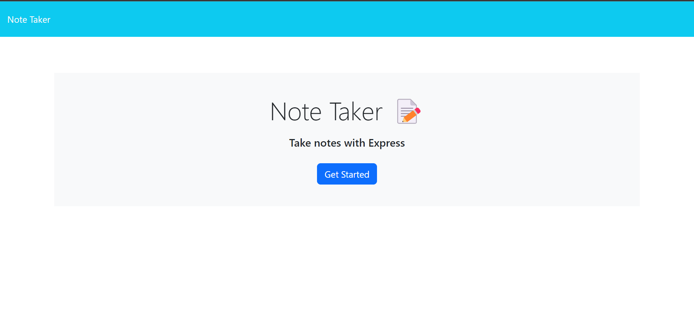
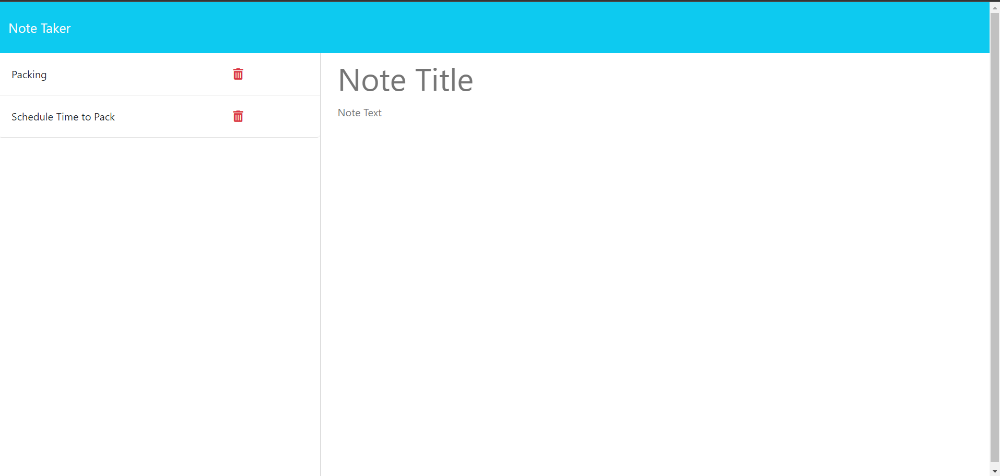

# Note Taker

## Description

The Note Taker application allows users to write, save, and delete notes. This application is built using Express.js for the backend and saves and retrieves note data from a JSON file. The frontend of the application has already been provided, and the challenge was to build the backend, connect it to the frontend, and deploy the entire application to Render.

## Table of Contents

- [Installation](#installation)
- [Usage](#usage)
- [API Routes](#api-routes)
- [Screenshots](#screenshots)
- [Deployment](#deployment)
- [License](#license)
- [Contributing](#contributing)
- [Questions](#questions)

## Installation

To get a local copy up and running, follow these steps:

1. Clone the repository:
   ```bash
   git clone https://github.com/DJDEVJAMS/note_taker.git
   ```
2. Navigate to the project directory:
   ```bash
   cd note-taker
   ```
3. Install the dependencies:
   ```bash
   npm install
   ```

## Usage

To start the application locally, run:

```bash
npm start
```

The application will be available at `http://localhost:3001` in your browser.

### Writing and Saving Notes

1. Click the "Get Started" button on the landing page to go to the notes page.
2. Enter a note title and text.
3. Click the "Save" button to save the note.
4. Saved notes will appear in the left-hand column.

### Deleting Notes

1. Click the trash can icon next to the note in the left-hand column to delete it.

## API Routes

- **GET `/api/notes`**: Retrieves all saved notes as JSON.
- **POST `/api/notes`**: Adds a new note to the `db.json` file.
- **DELETE `/api/notes/:id`**: Deletes a note by its ID.

## Screenshots

Here are some screenshots of the application:

### Landing Page


### Notes Page


## Deployment

The application is deployed on Render. You can view the live application here:

[Live Application on Render](https://note-taker-rv2u.onrender.com/)

## License

This project is licensed under the MIT License.

## Contributing

Contributions are welcome! Please feel free to submit a Pull Request.

## Questions

If you have any questions about the project, feel free to reach out via:

- GitHub: [DJDEVJAMS](https://github.com/DJdevjams)
- Email: alex.art.brown@gmail.com
